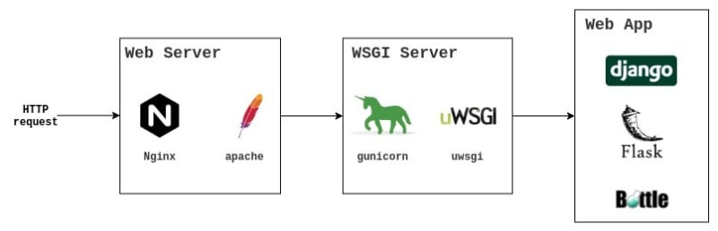

# Alpaca Dashboard(s)

Alpaca Dashboard(s) is an online visualisation tool built on top of a data analysis framework called Alpaca. ALl Python Analyses Code of Aegis (ALPACA) is a library written in Python for the Aegis experiment
at CERNs Antiproton Decelerator (AD). This tool allows users to create interactive charts and dashboards in order to observe and analyse data from experiment runs.

---

## Preview of the app

---

## Project idea and features

ALPACA has the ability to process and generate data from the experiment runs - the observables, that means data from numerous devices, detectors etc. ALPACA itself can only make singular plots of an observable or save larger amounts of data (multiple observables) in the filesystem - for future independent analysis and visualisations. Alpaca Dashboard(s) addresses the need for real-time, interactive visualisations of multiple observables from multiple runs at a time.

Project's objectives/features:
- every user (physicist or engineer from AEgIS) can create his own personalized dashboard - different members of the team would usually want to have a view of different observables suited for their specific needs
- dashboards can be saved and loaded again
- users can create new plots by choosing an observable from the right-side panel, they can also choose the chart type and title
- charts are movable and resizable
- currently displayed run number can be changed manually or the app automatically and continously selects the newest available run (by pressing the auto-update button)
- users can update the data for a specific number of runs, for example when the data in ALPACA itself has changed
- app should be accessible online through any browser inside and outside of CERN network

---

## How the app works

### Web application and server
The application is built mainly using the [Dash Open Source](https://dash.plotly.com/) library which is a framework for rapidly building data apps in Python and has all the tools needed to accomplish this project's objectives. Dash runs on top of another Python library - [Flask](https://flask.palletsprojects.com/en/2.3.x/) which makes the app run on a server and be available online.

### Database
Data from ALPACA is stored in a PostgreSQL database instance. A script - command line interface has beed made in ALPACA that allows the insertion of data of specified observables and runs to a database table. The observables in the experiment are continously changing and their data type isn't consistent, they can be 1D or 2D array or just a singular number. Therefore, the script had to achieve these things:
- automatically alter the table when new observables are added
- keep track of observable’s data types which means preserving their shape when inserting to database

### Architecture
Layout of communication between the instances inside of the project:

There are two ways in which data gets inserted to the database. Firstly, ALPACA always inserts the data from the newest run when that run has finished and the data is available (*continous_analyses.py*). The other way is that application itself activates *alpaca_to_database.py* script that updates the database for the specified run numbers (this is done by the *Specify the runs* with *From Alpaca* checked). Then the application can select the data from the database. For the purpose of environment isolation, future deployment and scalability the whole application (Dash/Flask app, PostgreSQL instance and ALPACA) runs in a [Docker](https://www.docker.com/) container. 

---

## Online accessibility
A standard scheme for deploying a Python web application:

Flask is a WSGI (Web Server Gateway Interface) application. A WSGI server is used to run the application, converting incoming HTTP requests to the standard WSGI environ, and converting outgoing WSGI responses to HTTP responses. Flask has a built-in development WSGI server but it should not be used in production, instead one should use a dedicated production WSGI server like [Gunicorn](https://gunicorn.org/). Gunicorn is a pure Python WSGI server with simple configuration and multiple worker implementations for performance tuning.

WSGI servers have HTTP servers built-in. However, a dedicated HTTP server like [Nginx](https://nginx.org/) may be safer, more efficient, or more capable. Putting an HTTP server in front of the WSGI server is called a *reverse proxy*. This *reverse proxy* can handle incoming requests, TLS, and other security and performance concerns better than the WSGI server.

Implementation of WSGI in Alpaca Dashboard(s):

Both Gunicorn and Nginx are in the same Docker container as the Alpaca Dashboard(s) application (Dash/Flask app, PostgreSQL instance and ALPACA). That allows the container to be run on a machine/server and instantly deploy the app there. The machine on which Alpaca Dashboard(s) is deployed to is *aegisonline*.
Inside of the Docker container Gunicorn runs the application on a WSGI server on port 5000 and Nginx listens on port 80 which is the default HTTP port. Whenever somebody tries to connect to *aegisonline* (through its IP on port 80 which does not need to be specified because its default) Nginx catches that request and passes it to port 5000 where the app is running.
